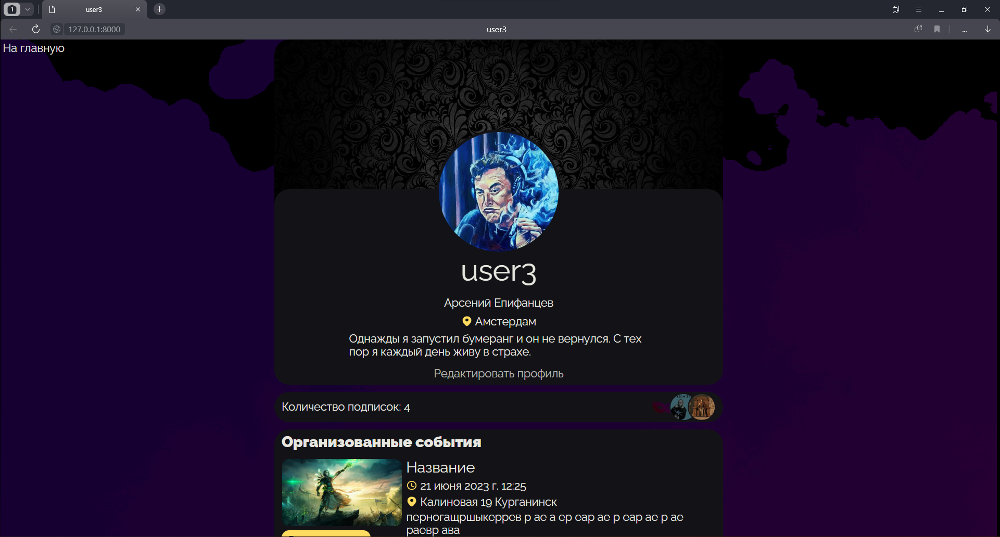

# EVENT MAP

Интерактивная карта для поиска мероприятий. Проект основан на Django и представляет собой веб-сервис, предназначенный для поиска мероприятий на интерактивной карте. Интерактивные карты реализованы с использованием Яндекс API и кастомизированы под нужды проекта, включая добавление собственных элементов дизайна и отображения информации.

## Основные характеристики:

### Аутентификация и авторизация:
В проекте реализована система аутентификации и авторизации пользователей, включающая проверку формы регистрации и обработку ошибок авторизации.

### Работа с базой данных:
Используется реляционная база данных PostgreSQL и библиотека psycopg2 в связке с Django моделями для работы с данными о пользователях, их профилях, подписках, мероприятиях.

### Интерактивная карта:
Для наполнения карты мероприятиями использовано API KUDAGO и функции геокодирования Яндекса.

### Подписки:
Авторизованным пользователям доступна функция подписки на мероприятия и профили других пользователей. Все подписки отображаются на странице избранного.

### Асинхронность:
Операции подписки и отписки осуществляются асинхронно, обеспечивая непрерывное взаимодействие пользователя с приложением.

### Создание событий:
Каждый авторизованный пользователь может создавать события, добавлять изображения, название, описание и адрес в свободном формате, при этом система автоматически проверяет координаты адреса. Дату проведения события можно выбирать с помощью интерактивного календаря.

### Профили пользователей:
Каждый профиль содержит созданные пользователем события и его подписки. Пользователь может редактировать свой профиль, менять информацию и изображения.

### Адаптивный дизайн:
Веб-сайт адаптирован под разные размеры экранов и предоставляет удобный интерфейс на всех уровнях проекта.

## Описание и скриншоты:

### Главная страница сайта:

Так она выглядит до авторизации:

Так после:

### Формы входа и регистрации:

### События на карте:

Координаты событий могут совпадать, тогда необходимо использовать ckusterer Яндекс API. Но стандартные кластеры выглядят вычурно, поэтому они были кастомизированы вместе с элементами управления картой.

### Создай своё событие:

Нажимаем на иконку "ручка и листок" на главной странице и попадаем на страницу создания события. Заполняем формы. Для удобства пользователя загруженная картинка отображается сразу. Проверить какие координаты будут записаны в базу данных по введенному адресу можно с помощью карты рядом. Ввод даты и времени осуществляется с помощью удобного календаря загруженного с CDN.

Находим событие на карте:

На странице мероприятия доступна подписка на него, если вы авторизованы, а также можно перейти в профиль организатора.

### Избранное:

Просматривать подписки можно на странице избранного. Там же можно отписываться. При этом запись о подписке в базу данных будет происходить сразу, асинхронно.

### Профиль:

У каждого пользователя есть профиль. Там содержится немного личной информации, которую владелец может редактировать. В случае не установки или удаления изображений, будут взяты стандартные. В профиле отображаются подписки владельца на других пользователей, а также созданные им мероприятия.

